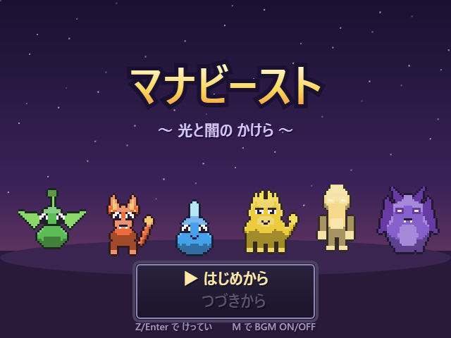
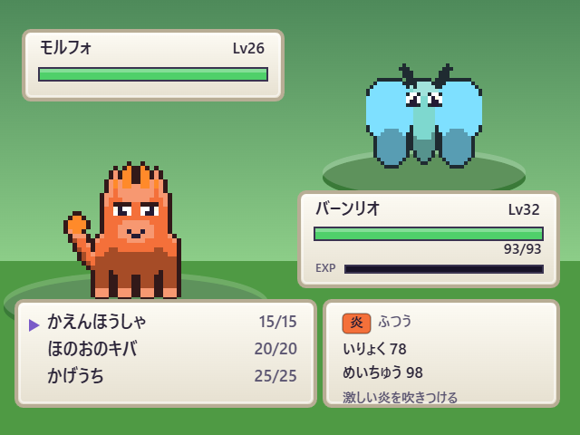
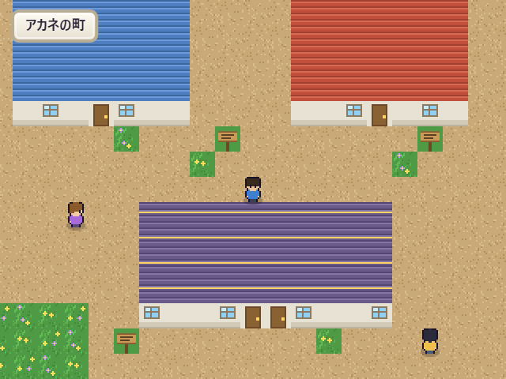
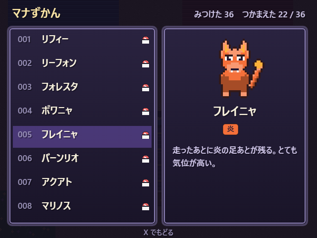

# マナビースト ～光と闇のかけら～

ブラウザで動く 2D モンスター収集RPG。
**画像ファイルは1枚も使っていません。** モンスターも人物も地形も、すべて実行時にコードで生成したピクセルアートです。

### ▶ [ここをクリックして あそぶ](https://aaaaaaaaaagrgr.github.io/manabeast/)



| | |
|---|---|
|  |  |



## あそびかた

| キー | はたらき |
|---|---|
| 方向キー / WASD | 移動 |
| Z / Enter / Space | 決定・話す・調べる |
| X / Esc | キャンセル・メニュー |
| Shift | ダッシュ |
| M | BGM の ON/OFF |

セーブは メニュー →「セーブ」、またはヒーリングセンターで休むと自動保存されます（localStorage）。

ローカルで動かす場合は `index.html` をダブルクリックするだけ。
（またはサーバー経由で: `python -m http.server 8129` → http://localhost:8129 ）

## 中身

- **36種のマナビースト**（進化14種を含む）／8属性の相性／状態異常4種（どく・まひ・ねむり・やけど）
- **51種のわざ**（威力・命中・PP・追加効果・優先度・ドレイン・反動・能力変化）
- **14マップ**：ミナト村 → 1ばん道路 → アカネの町 → 2ばん道路 → ミズホの街 → 樹海 → 雷鳴の山道 → 闇の神殿
- **ジムリーダー4人 ＋ ライバル4戦 ＋ ラスボス ＋ 隠し伝説**（ルミナ）、エンディング付き
- 捕獲／育成／進化演出／わざ習得／ショップ／ヒーリングセンター／あずかりシステム／マナずかん／トレーナーカード
- WebAudio によるチップチューンBGM 10曲＋効果音

想定プレイ時間：**約1時間**（図鑑コンプリートを狙うともっと遊べます）

## スプライト生成のしくみ

`js/sprites.js` に自前のピクセルアート生成エンジンがあります。

1. 32×32 のインデックスバッファに、体型アーキタイプ（獣・猫・鳥・魚・虫・蛾・竜・蛇・人型・植物・岩・幽霊・光球の13種）が
   楕円・三角・矩形といったプリミティブでシルエットを描く
2. 列ごとに上端を明色・下端を暗色へ置き換える **自動シェーディング**
3. シルエットの外周1pxを塗る **自動アウトライン**
4. 属性から生成したパレットを割り当てて canvas 化＆キャッシュ

体型 × 属性パレット × 装飾（角・翼・冠・目のスタイル）の組み合わせで36体を描き分けています。
人物（4方向2フレーム）とマップタイルも同じ方式で生成しています。

## ファイル構成

```
index.html
js/sprites.js    ピクセルアート生成エンジン
js/data.js       属性・相性表・わざ・どうぐ・成長計算
js/species.js    マナビースト図鑑36種
js/maps.js       タイル定義・マップビルダ・全マップ/NPC/トレーナー
js/audio.js      チップチューン合成
js/core.js       キャンバス・入力・UI部品・セーブ
js/ui.js         パーティ/どうぐ/ずかん/ボックス/ショップ画面
js/battle.js     ターン制バトル
js/overworld.js  フィールド移動・イベント・シナリオ
js/main.js       タイトル・メインループ
```

## ライセンス

MIT
